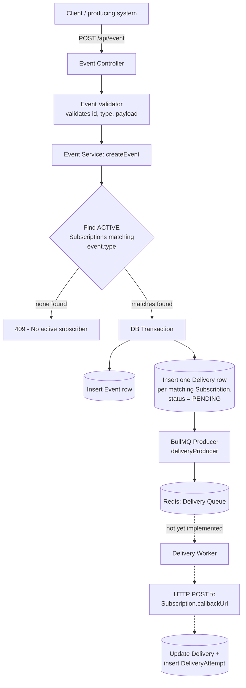
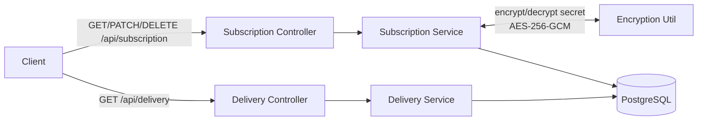

# Webhook Delivery Service

A standalone **webhook delivery microservice**. It accepts events from a producing system, matches them against registered subscriber endpoints, and is designed to deliver each matching event to its subscribers over HTTP — with retries, attempt tracking, and dead-lettering for failed deliveries.

It is built as a **microservice**, not a monolith: the HTTP-facing API (event/subscription intake, delivery lookups) and the delivery execution (the async worker) are two separate processes that share only the database and a Redis-backed job queue. The API never talks to a subscriber's endpoint directly — it only records intent (an `Event` and the `Delivery` rows it fans out to) and hands the job to a queue. Actual outbound delivery is the worker's job. This separation is intentional: a slow or failing subscriber endpoint cannot block event ingestion or API responsiveness.

## Current Status

This project has two halves at very different stages of completion. Read this section before the rest of the README — it tells you what actually works today.

| Component | Status |
|---|---|
| **API service** (`src/api`) | **Complete and manually tested.** All 10 endpoints across Event, Subscription, and Delivery are implemented, validated, and tested via the included `.rest` file. |
| **Delivery producer** (`src/shared/producer.js`) | **Implemented.** Pushes delivery jobs onto a BullMQ queue (`Delivery Queue`) using the `redis` (node-redis) client via BullMQ's `createNodeRedisClient` adapter. |
| **Delivery worker** (`src/worker`) | **Not implemented — design stage only.** `src/worker/index.js` currently contains a checklist and a rough pseudocode sketch, plus a single real Prisma query for pending deliveries. There is no queue consumer, no outbound HTTP delivery call, no retry/backoff logic, and no dead-letter transition implemented yet. `src/worker/utils/` is empty. |

**In short:** you can create subscriptions, create events, and see delivery records get created and queued — but nothing currently sends the actual HTTP request to a subscriber. That's the next piece of work.

## Architecture

```
                 ┌─────────────────────┐
  HTTP request → │   API service        │
                 │  (Express, port 8080)│
                 │  /api/event           │
                 │  /api/subscription    │
                 │  /api/delivery        │
                 └──────────┬───────────┘
                            │
                 ┌──────────▼───────────┐
                 │     PostgreSQL        │
                 │ Event / Subscription  │
                 │ Delivery / Attempt    │
                 └──────────┬───────────┘
                            │
                 ┌──────────▼───────────┐
                 │  BullMQ Queue (Redis) │  ← producer.js pushes here (done)
                 └──────────┬───────────┘
                            │
                 ┌──────────▼───────────┐
                 │   Delivery worker      │  ← NOT YET IMPLEMENTED
                 │  (separate process)    │
                 │  consumes queue,        │
                 │  sends HTTP requests    │
                 │  to subscriber URLs,    │
                 │  records attempts,      │
                 │  handles retry/DLQ      │
                 └───────────────────────┘
```

## Data Flow Diagram

**Write path — creating an event and fanning it out to subscribers:**



**Read path — subscription and delivery management:**



The dotted segment (worker onward) reflects the intended data flow — it's documented here because it's the contract the worker will need to fulfil, not because it currently executes.

## File Structure

```
webhook_delivery_service/
├── prisma/
│   ├── schema.prisma            # Event, Subscription, Delivery, DeliveryAttempt models
│   └── migrations/
├── src/
│   ├── api/                      # HTTP-facing service (complete)
│   │   ├── server.js              # Entry point: starts Express, handles SIGTERM
│   │   ├── boot/
│   │   │   └── app.js              # Express app assembly: helmet, body parsing, route mounting
│   │   ├── middleware/
│   │   │   ├── apperror.js           # AppError class (operational errors)
│   │   │   ├── generalValidator.js   # express-validator result handler -> AppError
│   │   │   └── globalError.middleware.js  # Central error handler (Prisma/validation/generic)
│   │   ├── modules/
│   │   │   ├── event/                # POST/GET event endpoints + validation + service
│   │   │   ├── subscription/         # Full CRUD for subscriptions + validation + service
│   │   │   └── delivery/             # Read-only delivery endpoints + validation + service
│   │   ├── utils/
│   │   │   └── uuid.js                # validateUuidV7 helper
│   │   └── test.rest                  # Manual REST Client test file (happy path)
│   ├── shared/                    # Code shared between API and worker
│   │   ├── config/
│   │   │   ├── env.js                 # Centralized environment variable access
│   │   │   └── prisma.js              # Prisma client instance
│   │   ├── logger/
│   │   │   └── logger.js              # Winston logger config
│   │   ├── utils/
│   │   │   ├── encryption.js          # AES-256-GCM encrypt/decrypt for subscription secrets
│   │   │   ├── redisconnect.js        # Redis client + BullMQ node-redis adapter connection
│   │   │   └── secret.js              # Random secret generator (crypto.randomBytes)
│   │   ├── prisma/generated/          # Generated Prisma client (build artifact, git-ignored)
│   │   └── producer.js                # BullMQ producer — queues delivery jobs (complete)
│   └── worker/                    # Delivery execution (NOT implemented)
│       ├── index.js                   # Planning checklist + pseudocode + one real query
│       └── utils/                     # Empty — no queue consumer or delivery logic yet
├── .env.example                   # Documents required env vars (tracked)
├── .env.production                # Real env values (git-ignored, not committed)
├── package.json
└── README.md
```

## Tech Stack

- **Runtime:** Node.js (ESM, `"type": "module"`)
- **API framework:** Express 5
- **Database:** PostgreSQL, via Prisma ORM (`@prisma/client`, `@prisma/adapter-pg`)
- **Queue:** BullMQ, backed by Redis via the `redis` (node-redis) client and BullMQ's node-redis adapter (`createNodeRedisClient`)
- **Validation:** express-validator
- **Security:** Helmet (HTTP headers), AES-256-GCM field-level encryption for subscription secrets
- **Logging:** Winston (structured JSON logs)
- **HTTP client (for future worker use):** axios
- **IDs:** UUIDv7 (`uuid` package) for all primary keys — sortable by creation time

## Data Model

Four Prisma models, all keyed on UUID:

- **`Event`** — `id`, `type`, `payload` (JSON), `createdAt`. Indexed on `type`.
- **`Subscription`** — `id`, `callbackUrl`, `status` (`ACTIVE` / `INACTIVE`), `type` (array of event types it subscribes to), `secret` (encrypted at rest), `createdAt`, `updatedAt`. Indexed on `status` and `callbackUrl`.
- **`Delivery`** — one row per (event, subscriber) pair. `status` (`PENDING`, `PROCESSING`, `SUCCESS`, `RETRYING`, `DEAD_LETTER`), `retryCount`, `nextRetryAt`, `startedAt`, `completedAt`, `lastError`. Indexed on `subscriptionId`, `status`, and `nextRetryAt`.
- **`DeliveryAttempt`** — one row per individual HTTP delivery attempt against a `Delivery`. `attemptNum`, timing (`startedAt`/`completedAt`/`durationMs`), `statusCode`, `errorMessage`, `nextRetryAt`. Unique on `(deliveryId, attemptNum)`.

This shape supports full delivery history and per-attempt observability, not just a single pass/fail flag per event.

## API Reference

All routes are mounted under `/api`. All responses follow `{ success, message, data }`; errors follow `{ success: false, message, data }` via a centralized error handler that maps Prisma constraint errors (unique/not-found/FK) and validation errors to appropriate HTTP status codes.

### Events — `/api/event`

| Method | Path | Description |
|---|---|---|
| `POST` | `/` | Create an event. Body: `{ id (uuid v7), type (string), payload (object) }`. Atomically finds all `ACTIVE` subscriptions matching `type`, creates the event, creates one `Delivery` row per matching subscription, and pushes them to the delivery queue. Returns `409` if no active subscriber matches the event type. |
| `GET` | `/:id` | Fetch a single event by UUIDv7. `404` if not found. |

### Subscriptions — `/api/subscription`

| Method | Path | Description |
|---|---|---|
| `POST` | `/` | Create a subscription. Body: `{ callbackUrl (https url; http allowed only in development), type (array, min 1), secret (string) }`. Secret is encrypted (AES-256-GCM) before storage. |
| `GET` | `/` | List subscriptions, paginated (`page`, `limit` query params, limit capped at 100). |
| `GET` | `/:id` | Fetch a single subscription. `404` if not found. |
| `PATCH` | `/:id` | Partial update — any of `callbackUrl`, `status` (`ACTIVE`/`INACTIVE`), `type`, `secret`. At least one field required. Re-encrypts `secret` if provided. |
| `DELETE` | `/:id` | Delete a subscription. Blocked with `409` if the subscription has any delivery in `PENDING`, `PROCESSING`, `RETRYING`, or `DEAD_LETTER` state. **Note:** on successful deletion, *all* deliveries for that subscription are removed, including completed (`SUCCESS`) ones — this currently erases delivery history along with the subscription rather than preserving it. |

### Deliveries — `/api/delivery` (read-only)

| Method | Path | Description |
|---|---|---|
| `GET` | `/` | List all deliveries, paginated. |
| `GET` | `/:id` | Fetch a single delivery by UUIDv7. `404` if not found. |
| `GET` | `/event/:id` | List all deliveries for a given event, paginated. `404` if none exist. |

All UUID path/body params are validated as UUIDv7 specifically (`validateUuidV7`), not just any UUID version.

## Security Notes

- Subscription `secret` values are encrypted at rest using AES-256-GCM (random 12-byte IV per encryption, auth tag stored alongside ciphertext) — never stored in plaintext.
- `callbackUrl` must be HTTPS in production; HTTP is only accepted when `NODE_ENV=development`.
- Helmet is applied globally for standard security headers.
- Request bodies are size-limited (`express.json({ limit: "100kb" })`).
- `.env.production` is git-ignored and is not committed; only `.env.example` (with placeholder values) is tracked.

## Environment Variables

See `.env.example`. Required variables:

| Variable | Purpose |
|---|---|
| `DATABASE_URL` | PostgreSQL connection string |
| `REDIS_URL` | Redis connection string (used for the BullMQ queue) |
| `REDIS_MAX_RETRIES` | Max reconnect attempts before giving up (exponential backoff) |
| `SECRET_KEY` | Symmetric key used to encrypt/decrypt subscription secrets |
| `ENCRYPTION_ALGORITHM` | Cipher algorithm (currently `aes-256-gcm`) |
| `PORT`, `HOST` | API server bind address |
| `NODE_ENV` | `development` / `production` — affects which `callbackUrl` protocols are accepted |
| `NODE_VERSION` | Pinned Node version |

## Running Locally

```bash
npm install
npx prisma migrate deploy   # apply schema
npm run dev                 # starts the API on $PORT (src/api/server.js)
```

There is currently no separate `npm` script to start the worker, since the worker isn't implemented yet.

## Testing

Manual endpoint testing is done via `src/api/test.rest` (VS Code REST Client format), covering the happy path for all three resource types with realistic UUIDv7 sample data. It does not currently cover negative/edge cases (invalid payloads, protocol violations, deleting a subscription with pending deliveries, etc.) even though the service layer explicitly handles those cases — that test coverage is a known gap, not a hidden one.

No automated test suite exists yet (`npm test` is a placeholder).

## Known Limitations / Roadmap

- **Delivery worker is unbuilt.** This is the main outstanding piece: consuming the BullMQ queue, making the outbound HTTP call with signed payloads, classifying responses, updating `Delivery`/`DeliveryAttempt` state, implementing retry/backoff, and transitioning exhausted deliveries to `DEAD_LETTER`.
- **No admin/monitoring surface** for dead-lettered deliveries or manual replay — planned as part of worker work.
- **Subscription deletion removes delivery history**, including successful deliveries, rather than preserving an audit trail.
- **No automated tests** — coverage today is manual, via the `.rest` file, happy-path only.
- Minor logging typos exist in a few `logger.info` calls (cosmetic, no functional impact).

## Author

**pshed-001** — [github.com/pshed-001](https://github.com/pshed-001)
